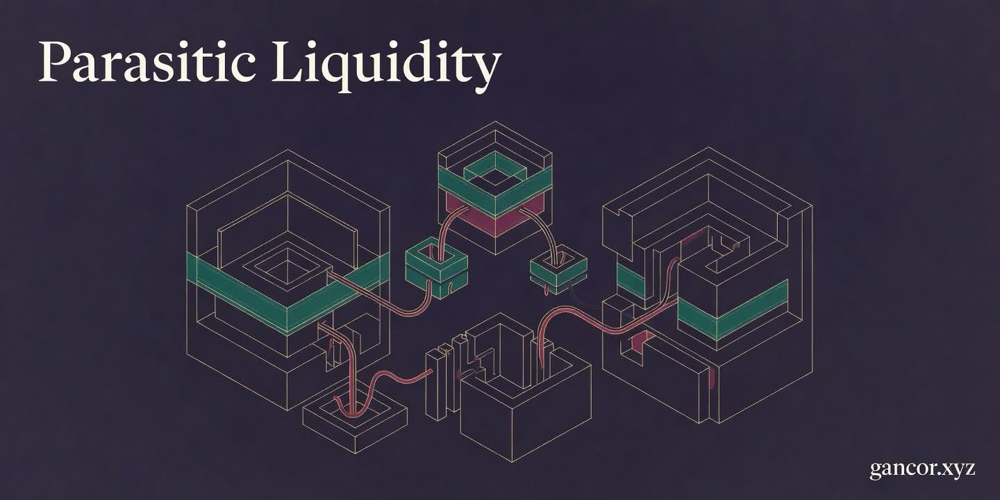

<p align="center">
  
</p>

# Parasitic Liquidity

Paper sources for *Parasitic Liquidity: Emission Extraction via Non-Functional Concentrated Liquidity Positions* (K. R. Ryan, 2026).

*Parasitic liquidity* is an emission extraction strategy on concentrated liquidity DEXs whose gauges use the Synthetix instantaneous-stake accumulator. Three propositions characterise the mechanism: gauge accrual is memoryless in stake duration, independent of position width per unit of liquidity, and uncoupled from utilisation. Foundry suites against unmodified mainnet contracts on Base verify all three properties on Slipstream gauges and PancakeSwap MasterChefV3. The paper supports the Foundry results with a point-in-time and longitudinal on-chain audit, a 31-day cross-chain affordability sample, and an analytical evaluation of two-gauge level remediations.

| | |
|---|---|
| **Author** | K. R. Ryan, independent researcher |
| **Contact** | [gancor.xyz](https://gancor.xyz) · ORCID [0009-0004-6295-7040](https://orcid.org/0009-0004-6295-7040) |
| **Paper DOI** | [](https://doi.org/10.5281/zenodo.19528399) |
| **SSRN** | [6510118](https://papers.ssrn.com/sol3/papers.cfm?abstract_id=6510118) |
| **Licence** | paper PDF and LaTeX source © K. R. Ryan, all rights reserved; companion code (when released) MIT |

**Status.** *This is a working paper.* The PDF in `paper/` is a revised preprint of the SSRN entry above and is not peer-reviewed. The reproduction code (Foundry suites for Slipstream and PancakeSwap MasterChefV3, and the cross-chain affordability and longitudinal-scan pipelines) is held back pending verification and will be released in a subsequent revision under MIT alongside a Zenodo dataset deposit.

## Companion papers

| | Where | Status |
|---|---|---|
| The Geometric Siphon (Paper I): Emergent Capital Reallocation in Concentrated Liquidity Portfolios | [SSRN 6374838](https://papers.ssrn.com/sol3/papers.cfm?abstract_id=6374838) | Live preprint |
| The Geometric Siphon II: Directional Properties | [SSRN 6481498](https://papers.ssrn.com/sol3/papers.cfm?abstract_id=6481498) | Live preprint |
| Parasitic Liquidity (this paper) | [SSRN 6510118](https://papers.ssrn.com/sol3/papers.cfm?abstract_id=6510118) | Live preprint, revised working paper here |
| Constructive Gauges: Concentration-Weighted Emission Distribution for CL DEXs | [SSRN 6625980](https://papers.ssrn.com/sol3/papers.cfm?abstract_id=6625980) | Live preprint |

The Geometric Siphon papers characterise the geometric residual that arises on LP rebalancing under shared depositor balances. *Parasitic Liquidity* analyses the emission-side analogue, where staked positions accrue gauge rewards without providing tradeable depth. *Constructive Gauges* presents the protocol-side response, replacing nominal liquidity in the gauge formula with a scoring function that conditions emission accrual on duration, width, and tradeable-depth provision.

## Citation

```bibtex
@techreport{ryan2026parasitic,
  author      = {Ryan, K. R.},
  title       = {Parasitic Liquidity: Emission Extraction via
                 Non-Functional Concentrated Liquidity Positions},
  institution = {SSRN},
  number      = {6510118},
  year        = {2026},
  url         = {https://papers.ssrn.com/sol3/papers.cfm?abstract_id=6510118}
}
```

A `CITATION.cff` with the same metadata is included at the repository root.

## Layout

```
.
├── paper/
│   ├── parasitic-liquidity.tex     paper source (xelatex, TeX Gyre Termes)
│   └── parasitic-liquidity.pdf     compiled PDF
├── .github/
│   └── banner.jpg
├── CITATION.cff
├── LICENSE
└── README.md
```

Reproduction code and datasets will be added in a subsequent revision.

## Building the paper

```bash
cd paper
xelatex parasitic-liquidity.tex
xelatex parasitic-liquidity.tex   # second pass for cross-references
```

Requires `xelatex` with `texgyretermes`, `unicode-math`, `pgfplots` (≥ 1.18), `microtype`, `mdframed`, and `placeins`. Two passes resolve the bibliography and cross-references. Output is a single self-contained PDF at `paper/parasitic-liquidity.pdf`.
